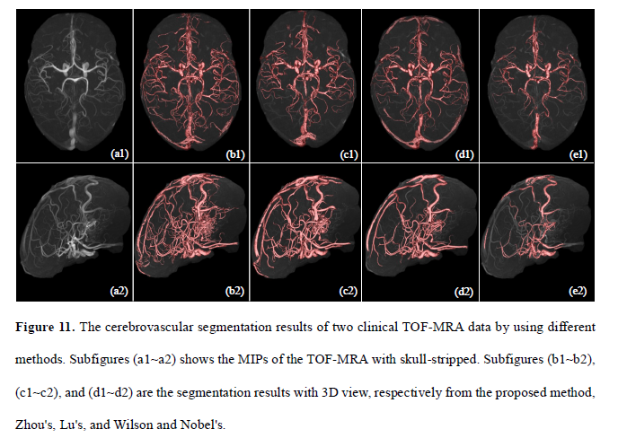
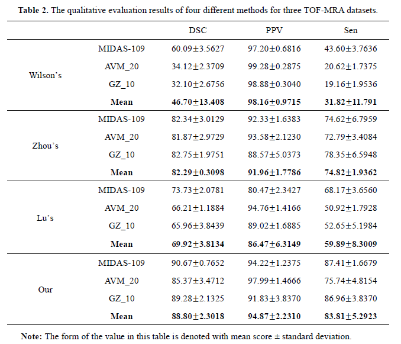
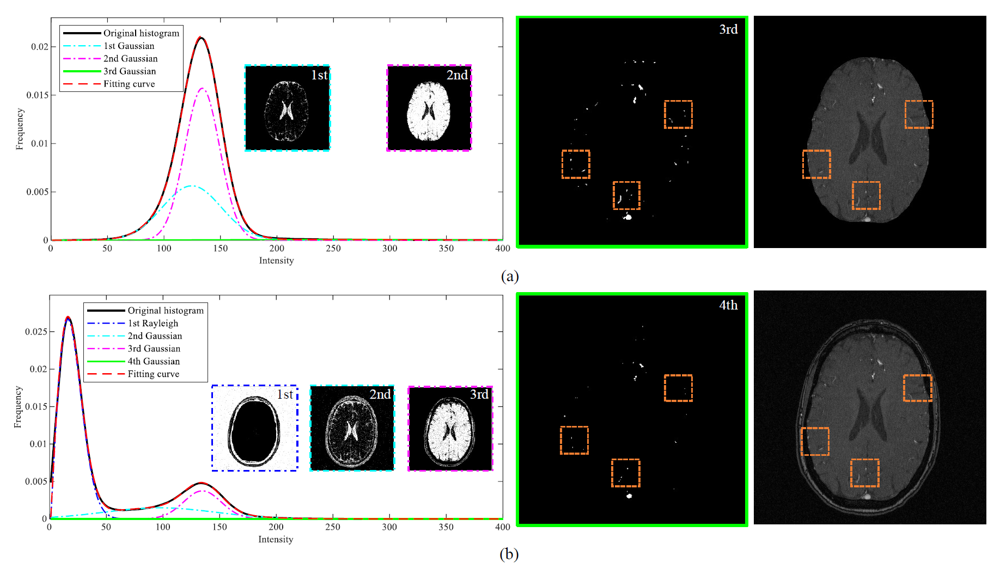

# statistical-method-for-cerebrovascular-segmentation
A novel statistical method for cerebrovascular segmentation

Here are some results:

Please reference:
Zhang, Baochang, et al. "A Device-Independent Novel Statistical Modeling for Cerebral TOF-MRA Data Segmentation." Uncertainty for Safe Utilization of Machine Learning in Medical Imaging and Clinical Image-Based Procedures. Springer, Cham, 2019. 172-181. [https://link.springer.com/chapter/10.1007/978-3-030-32689-0_18]
